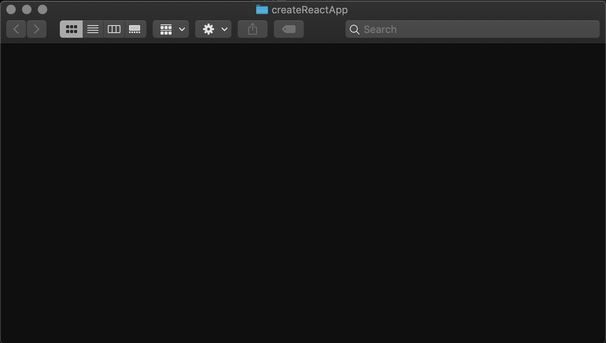
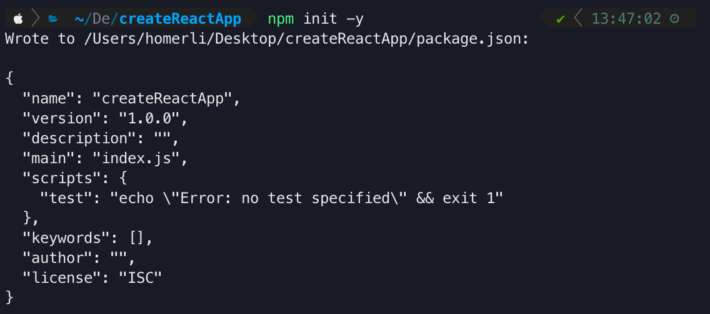
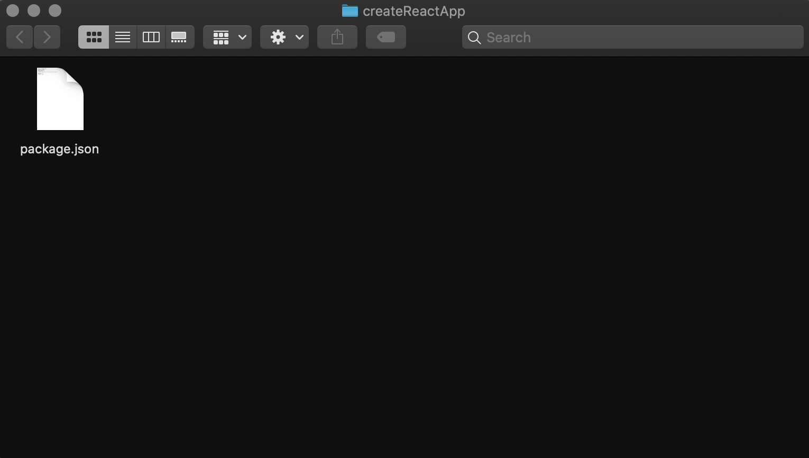
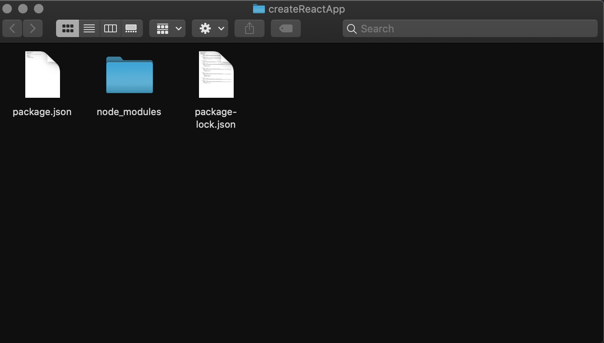
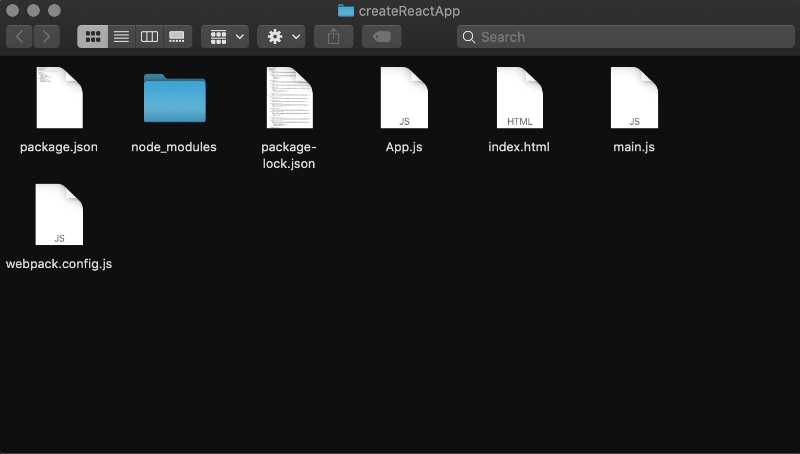

# Installation
{: .no_toc }

A step by step instruction on how to install the required software for setting up the react environment from scratch. By the end of this step you will have a empty react ready directory to work with.

{: .fs-6 .fw-300 }

## Table of contents
{: .no_toc .text-delta }

1. TOC
{:toc}

---

<div style="margin-left: 50px; display: flex; align-items: center;">
    
      <article style="border: 2px solid black; box-sizing: border-box; padding: 5px;"> <strong>Note: </strong>The following step requires you to have basic knowledge about HTML CSS and Javascript. Moreover, a basic understanding of ES6 features, such as let, const, arrow function.</article>
</div>


## Step 1 - create a root folder

Open your "Terminal" and enter the following code.
 
```bash
$ cd Desktop
$ mkdir createReactApp
$ cd creatReactApp
$ open .
```

At this point, you should have a empty folder call "createReactApp"




## Step 2 - create **package.json** file

Still in your "Terminal". To create any module or use any third-party library, it is required to generate a **package.json** file. This file contains a version of the module that you installed before. Moreover, if you want to share your folder with the other developer, they will know what package you used for this project.  

```bash
$ npm init -y
$ touch .gitingore
```

After this `npm init -y`, you will see this in your "Terminal".



After this step , you will have this in your "createReactApp" folder.




## Step 3 - install React and react dom

The (react) package provides the necessary method to define React components.
The (react-dom) package provides DOM-specific(client side) methods that can be used at the top level of your app and as an escape hatch to get outside of the React model if you need to. 

```bash
$ npm i react --save
$ npm i react-dom --save
```

Or you can just use one command

```bash 
$ npm i react react-dom --save
```

After you type the code, you should see this in your "Terminal".


Your **package.json** should look like this.

```json
{
	"name": "createReactApp",
	"version": "1.0.0",
	"description": "",
	"main": "index.js",
	"scripts": {
		"test": "echo \"Error: no test specified\" && exit 1"
	},
	"keywords": [],
	"author": "",
	"license": "ISC",
	"dependencies": {
		"react": "^16.13.0",
		"react-dom": "^16.13.0"
	}
}
```

After this step , you will have this in your "createReactApp" folder.




## Step 4 - install webpack

(Webpack) is an open-source software that bundle **JavaScript** with the browser. (Webpack Dev Server) used as a HTTP server for serving files while developing. (webpack-cli) a command language that use with (webpack).

In you "Terminal: "
 
```bash
$ npm install webpack --save
$ npm install webpack-dev-server --save
$ npm install webpack-cli --save
```

Or you can just use one command

```bash
$ npm install webpack webpack-dev-server webpack-cli --save
```

After this step, your **package.json** should look like this:

```json
{
	"name": "createReactApp",
	"version": "1.0.0",
	"description": "",
	"main": "index.js",
	"scripts": {
		"test": "echo \"Error: no test specified\" && exit 1"
	},
	"keywords": [],
	"author": "",
	"license": "ISC",
	"dependencies": {
		"react": "^16.13.0",
		"react-dom": "^16.13.0",
		"webpack": "^4.42.0",
		"webpack-cli": "^3.3.11",
		"webpack-dev-server": "^3.10.3"
	}
}
```


## Step 5 - install babel

Babel is a compiler that you can write JavaScript code in the latest version, even when your supported environments don't support the syntax. And how babel does is that it will compile the code to the working version.

```bash
$ npm add @babel/runtime --save-dev
$ npm install @babel/core --save-dev
$ npm install @babel/preset-react --save-dev
$ npm install @babel/preset-env --save-dev
$ npm install babel-loader --save-dev
$ npm install html-webpack-plugin --save-dev
```

After this step, you will see this in you **package.json**.
```json
{
	"name": "createReactApp",
	"version": "1.0.0",
	"description": "",
	"main": "index.js",
	"scripts": {
		"test": "echo \"Error: no test specified\" && exit 1"
	},
	"keywords": [],
	"author": "",
	"license": "ISC",
	"dependencies": {
		"react": "^16.13.0",
		"react-dom": "^16.13.0",
		"webpack": "^4.42.0",
		"webpack-cli": "^3.3.11",
		"webpack-dev-server": "^3.10.3"
	},
	"devDependencies": {
		"@babel/preset-react": "^7.8.3",
		"@babel/core": "^7.8.7",
		"@babel/preset-env": "^7.8.7",
		"babel-loader": "^8.0.1",
		"html-webpack-plugin": "^3.2.0"
	}
}

```
Or you can just use one comment

```bash 
$ npm install babel-core babel-loader babel-preset-env babel-preset-react html-webpack-plugin --save-dev
```


## Step 6 - Create files

At this step, you will need to create files that are needed for configuration.

```bash
$ touch index.html
$ touch App.js
$ touch main.js
$ touch webpack.config.js
$ touch .babelrc
```

After this step, you will have this in you "createReactApp" folder.


