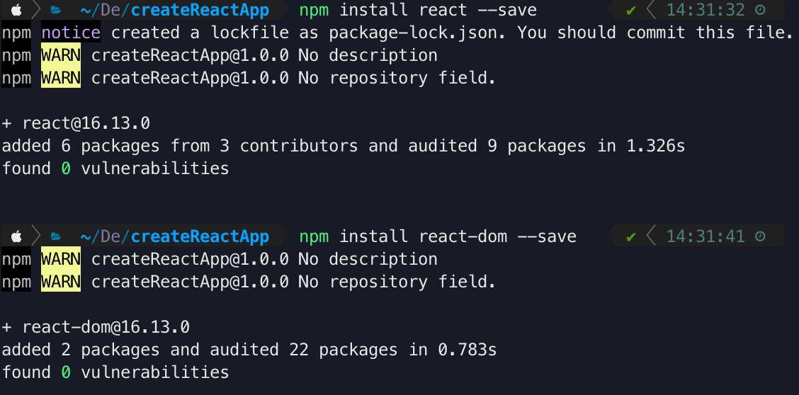

# Installation
{: .no_toc }

The following are steps needed to install the required software for setting up the react environment. By the end of these steps you will have a react ready directory to work with.


## Table of contents
{: .no_toc .text-delta }

1. TOC
{:toc}

---

<!-- <div style="margin-left: 50px; display: flex; align-items: center;">
    
      <article style="border: 2px solid black; box-sizing: border-box; padding: 5px;"> <strong>Note: </strong>The following step requires you to have basic knowledge about HTML CSS and Javascript. Moreover, a basic understanding of ES6 features, such as let, const, arrow function.</article>
</div> -->


## Create a root folder

1. Open your "Terminal" and *enter* the following code.
 
```bash
$ cd Desktop
$ mkdir createReactApp
$ cd creatReactApp
$ open .
```

At this point, you should have an empty folder called "createReactApp"


--- 

## Create **package.json** file

We have to initialize npm by running the following code in your terminal. 
This will create the **package.json** file.

1. Open your "Terminal" and *enter* the following code.

```bash
$ npm init -y
```

After this `npm init -y`, you will see this in your "Terminal".


After this step, you will have this in your "createReactApp" folder.


<div style="margin-left: 50px; display: flex; align-items: center;">
    
      <article style="border: 2px solid black; box-sizing: border-box; padding: 5px;"> <strong>Note: </strong>To create any module or use any third-party library, it is required to generate a <strong>package.json</strong> file. This file contains a version of the module that you installed before. Moreover, if you want to share your folder with the other developer, they will know what packages you used for this project. However, always create a .gitignore file and add "node_modules/" to its contents to avoid sending the actual packages back and forth.</article>
</div>

---

## Install **react** and **react dom**

The (react) package provides the necessary method to define React components.
The (react-dom) package provides DOM-specific(client side) methods that can be used at the top level of your app and as an escape hatch to get outside of the React model if you need to. 

1. Open your "Terminal" and *enter* the following code.

```bash
$ npm i react --save
$ npm i react-dom --save
```

Or you can just use one command:

```bash 
$ npm i react react-dom --save
```

After you type the code, you should see this in your "Terminal".



Now open "VSCode" to view and edit the file contents of the project folder.

2. Still in your "Terminal" and *enter* the following code.

```bash
$ code .
```

Your **package.json** should look like this.

```json
{
	"name": "createReactApp",
	"version": "1.0.0",
	"description": "",
	"main": "index.js",
	"scripts": {
		"test": "echo \"Error: no test specified\" && exit 1"
	},
	"keywords": [],
	"author": "",
	"license": "ISC",
	"dependencies": {
		"react": "^16.13.0",
		"react-dom": "^16.13.0"
	}
}
```

After this step, you will have this in your "createReactApp" folder.


---

## Install **webpack**

(Webpack) is an open-source software that bundles **JavaScript** with the browser. (Webpack Dev Server) used as an HTTP server for serving files while developing. (webpack-cli) a command language that's used with (webpack).

1. Open your "Terminal" and *enter* the following code.
 
```bash
$ npm install webpack --save
$ npm install webpack-dev-server --save
$ npm install webpack-cli --save
```

Or you can just use one command:

```bash
$ npm install webpack webpack-dev-server webpack-cli --save
```

After this step, your **package.json** should look like this:

```json
{
	"name": "createReactApp",
	"version": "1.0.0",
	"description": "",
	"main": "index.js",
	"scripts": {
		"test": "echo \"Error: no test specified\" && exit 1"
	},
	"keywords": [],
	"author": "",
	"license": "ISC",
	"dependencies": {
		"react": "^16.13.0",
		"react-dom": "^16.13.0",
		"webpack": "^4.42.0",
		"webpack-cli": "^3.3.11",
		"webpack-dev-server": "^3.10.3"
	}
}
```

---

## Install **babel**

(Babel) is a compiler that allows you to write JavaScript code in the latest version, even when your environments don't support the latest syntax. (Babel) will compile the code you write to the working version of the environment.

1. Open your "Terminal" and *enter* the following code.

```bash
$ npm install @babel/runtime --save-dev
$ npm install @babel/core --save-dev
$ npm install @babel/preset-react --save-dev
$ npm install @babel/preset-env --save-dev
$ npm install babel-loader --save-dev
$ npm install html-webpack-plugin --save-dev
```

Or you can just use one command:

```bash 
$ npm install @babel/runtime @babel/core @babel/preset-react @babel/preset-env babel-loader html-webpack-plugin --save-dev
```

After this step, you will see this in your **package.json**.
```json
{
	"name": "createReactApp",
	"version": "1.0.0",
	"description": "",
	"main": "index.js",
	"scripts": {
		"test": "echo \"Error: no test specified\" && exit 1"
	},
	"keywords": [],
	"author": "",
	"license": "ISC",
	"dependencies": {
		"react": "^16.13.0",
		"react-dom": "^16.13.0",
		"webpack": "^4.42.0",
		"webpack-cli": "^3.3.11",
		"webpack-dev-server": "^3.10.3"
	},
	"devDependencies": {
		"@babel/core": "^7.8.7",
    	"@babel/preset-env": "^7.8.7",
    	"@babel/preset-react": "^7.8.3",
    	"@babel/runtime": "^7.8.7",
    	"babel-loader": "^8.0.6",
    	"html-webpack-plugin": "^3.2.0"
	}
}

```

---

## Create files

At this step, you will need to create files that are needed for configuration.

1. Open your "Terminal" and *enter* the following code.
 
```bash
$ touch index.html
$ touch App.js
$ touch main.js
$ touch webpack.config.js
$ touch .babelrc
```

Or you can just use one command:

```bash 
$ touch index.html App.js main.js webpack.config.js .babelrc
```

After this step, you will have this in you "createReactApp" folder.


