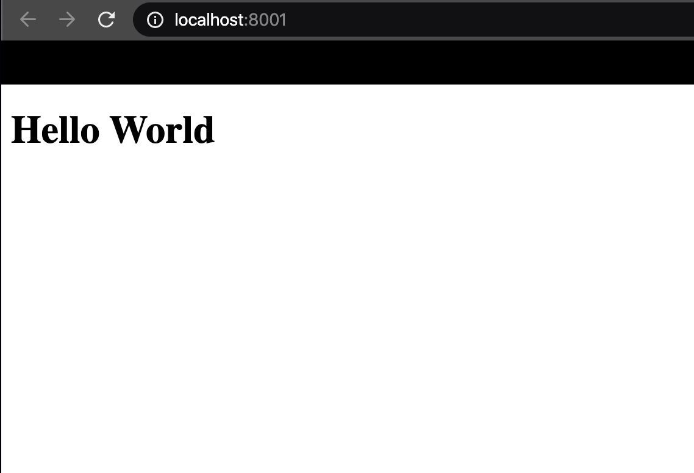

# Testing
{: .no_toc }

The following are steps needed to test your react environment. By the end of these steps you will know if your react enviornment was successfully configured and ready for customization.

## Table of contents
{: .no_toc .text-delta }

1. TOC
{:toc}

---

## Testing one: Hello World

In the last section, you already configure the **webpack** and the **babel**. Therefore, you can just type one comment in the "Terminal" to see whether the environment work or not.

<div style="margin-left: 50px; display: flex; align-items: center;">
    
      <article style="border: 2px solid black; box-sizing: border-box; padding: 5px;"> <strong>Note: </strong>If there's a error occurred, please go to Troubleshooting section to look for "How to resolve".</article>
</div><br>

Comment at below:
```bash
$ npm start
```

In "http://localhost:8001/" you will see this.


