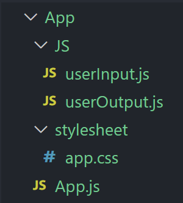

# How to set up your first react page with JSX and CSS.
{: .no_toc }

The following are steps needed to customize and configure your react environment for JSX with CSS. By the end of these steps your react environment will be ready to use JSX with CSS.


## Table of contents
{: .no_toc .text-delta }

1. TOC
{:toc}

---

<div style="margin-left: 50px; display: flex; align-items: center;">
    
      <article style="border: 2px solid black; box-sizing: border-box; padding: 5px;"> <strong>Note: </strong>Please follow the guide thoroughly, otherwise, it may not work as expected.</article>
</div>

## Install loader
 
In order to add style in your website, you must install css-loader first. Its purpose is to load the CSS file.
<br>
<div style="margin-left: 50px; display: flex; align-items: center;">
    
      <article style="border: 2px solid black; box-sizing: border-box; padding: 5px;"> <strong>Note: </strong>If you don't know how to access your "Terminal" in your VSCode. The shortcut is <i>Ctrl + i</i></article>
</div>
<br/>

1. *Open* your VSCode "Terminal", and *enter* the following code.

> ```bash
> $ npm install css-loader --save-dev
> $ npm install style-loader --save-dev
> ```

After the installation, your **package.json** should look like this

> ```json
> {
>     "name": "createReactApp",
> 	  "version": "1.0.0",
> 	  "description": "",
> 	  "main": "index.js",
> 	  "scripts": {
>   	  "start": "webpack-dev-server --mode development --open --hot",
> 		  "build": "webpack --mode production"
> 	  },
> 	  "keywords": [],
> 	  "author": "",
> 	  "license": "ISC",
> 	  "dependencies": {
>     		"react": "^16.13.0",
> 	  	"react-dom": "^16.13.0",
> 	  	"webpack": "^4.42.0",
> 	  	"webpack-cli": "^3.3.11",
> 	  	"webpack-dev-server": "^3.10.3"
> 	  },
> 	  "devDependencies": {
>     	"@babel/core": "^7.8.7",
> 	  	"@babel/preset-env": "^7.8.7",
> 	  	"@babel/preset-react": "^7.8.3",
> 	  	"babel-loader": "^8.0.1",
> 	  	"css-loader": "^3.4.2",
> 	  	"html-webpack-plugin": "^3.2.0",
>       "style-loader": "^1.1.3"
> 	  }
> } 
> ```

---

## Change your **webpack.config.js** file

To use the package you just installed, you need to *change* you **webpack.config.js** file.

1. *Open* your **webpack.config.js** file, you need to *add* this in the rule section.

> ```json
> { test: /\.css$/, loader: ["style-loader", "css-loader"] }
> ```

---

## Install babel plugin

Because we are using the class base react in this instruction; therefore, in order to use class components, we need to install a babel plugin.

1. *Open* your VSCode "Terminal", and *enter* the following code.

> ```bash
> $ npm install @babel/plugin-proposal-class-properties --save-dev
> ```

After installation, your **package.json** should look like this

>```json
>{
>    "name": "createReactApp",
>	  "version": "1.0.0",
>	  "description": "",
>	  "main": "index.js",
>	  "scripts": {
>  	  "start": "webpack-dev-server --mode development --open --hot",
>		  "build": "webpack --mode production"
>	  },
>	  "keywords": [],
>	  "author": "",
>	  "license": "ISC",
>	  "dependencies": {
>    	"react": "^16.13.0",
>	  	"react-dom": "^16.13.0",
>	  	"webpack": "^4.42.0",
>	  	"webpack-cli": "^3.3.11",
>	  	"webpack-dev-server": "^3.10.3"
>	  },
>	  "devDependencies": {
>    	"@babel/core": "^7.8.7",
>      "@babel/plugin-proposal-class-properties": "^7.8.3",
>	  	"@babel/preset-env": "^7.8.7",
>	  	"@babel/preset-react": "^7.8.3",
>	  	"babel-loader": "^8.0.1",
>	  	"css-loader": "^3.4.2",
>	  	"html-webpack-plugin": "^3.2.0",
>      "style-loader": "^1.1.3"
>	  }
>} 
>```

---

## Configure the **.babelrc** file

In order to make usage of the babel plugin, we need to *add* a configuration to the **.babelrc** file. 

1. *Open* your **.babelrc** file, you need to change your **.babelrc** file to the following code.

> ```json
> {
>     "presets": ["@babel/env", "@babel/preset-react"],
>     "plugins": [["@babel/plugin-proposal-class-properties", { "loose": true }]]
> }
> ```

---

## Create folders and files

This step is not very important, but it will be best if you want to keep your folder looks clean.

1. *Open* your VSCode "Terminal", and *enter* the following code.

> ```bash
> $ mkdir App
> $ cd App
> $ mkdir JS
> $ mkdir stylesheet
> $ cd JS
> $ touch userInput.js
> $ touch userOutput.js
> $ cd ../stylesheet
> $ touch app.css
> 
> ##At last, you need to move your App.js in the App folder
> ```

After this step, you should see this in the left sidebar in your VSCode.

