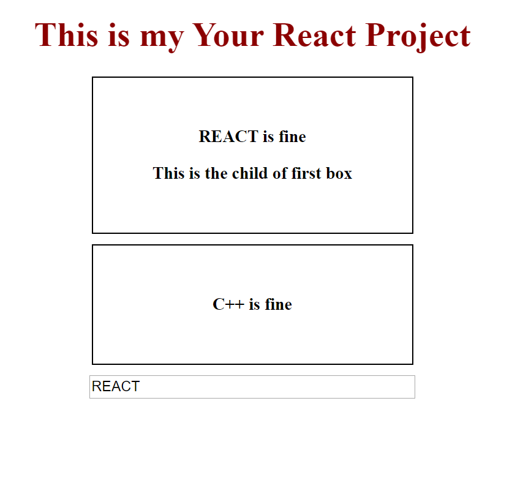

# How to customize your environment for JSX and CSS.
{: .no_toc }

The following are steps needed to create your first react page with JSX and CSS. By the end of these steps your will build a react page with JSX and CSS.

## Table of contents
{: .no_toc .text-delta }

1. TOC
{:toc}

---

## Step 1 - Modify **App.js**

Add new JSX code to make your own pages. JSX allows you to write HTML code in JavaScript way, without using syntax like createElement() or appendChild().

Add code belows:

```js
import React, { Component } from "react";
import IN from "./JS/userInput";
import OUT from "./JS/userOutput";
import "./stylesheet/app.css";

class App extends Component {
    state = {
      condition: [
        {
          type: "REACT"
        },
        {
          type: "C++"
        }
      ]
    };

    SwitchName = event => {
      this.setState({
        condition: [
          {
            type: event.target.value
          },
          {
            type: "C++"
          }
        ]
      });
    };

    render() {
      return (
        <div className="App">
          <h1 className="project_title">This is my Your React Project</h1>
          <OUT type={this.state.condition[0].type}>
            This is the child of first box
          </OUT>
          <OUT type={this.state.condition[1].type} />
          <IN name={this.state.condition[0].type} changed={this.SwitchName} />
        </div>
      );
    }
} 
export default App;
```


## Step 2 - Add style code

In this step, you will know how to add more css code to your own react project.

Open you **app.css** file, and add more css code in it. At this stage, you can add more personal preference to the css code to make it more appealing.

Add code below:

```css
.project_title {
  color: darkred;
}

.p {
  margin: 10px auto;
  box-sizing: border-box;
  padding: 30px;
  border: 1px solid #000000;
  font-weight: bolder;
  width: 300px;
}

.p:nth-child(3) {
  cursor: pointer;
}

.p:nth-child(3):hover {
  color: rebeccapurple;
}

.inputspace {
  width: 300px;
}
```


## Step 3 - Add JavaScript to **userInput.js** file

At this step, you will need to add more JSX code in your **userInput.js** file. In your **userInput.js**, and add some JSX in it. 

Add code below:

```js
import React from "react";
const userInput = props => {
    return (
      <div>
        <input
          className="inputspace"
          type="text"
          onChange={props.changed}
          value={props.name}
        />
      </div>
    );
};

export default userInput;

```


## Step 4 - Add JavaScript to **userOutput.js** file

At this step, you will need to add more JSX code in your **userOutput.js** file. In your **userOutput.js**, and add some JSX in it. 

Add code below:

```js
import React from "react";

const userOutput = props => {
    return (
      <div className="p">
        <p onClick={props.click}>{props.type} is fine</p>
        <p>{props.children}</p>
      </div>
    );
  };

export default userOutput;
```


## Step 5 - npm start

At this step and also your last step, open your VScode "Terminal, " and start typing.

```bash
$ npm start
```

After the build is done, you will see this in "http://localhost:8001/"




## Congrats you have your first react page now
